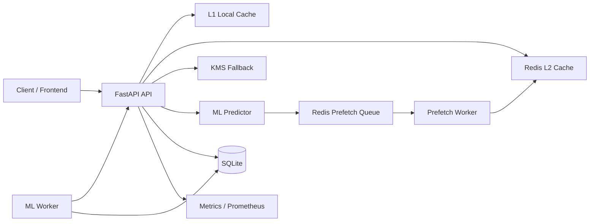

# PSKC

PSKC adalah singkatan dari **Predictive Secure Key Caching**.

PSKC adalah sistem untuk mengurangi latensi akses kunci dengan menggabungkan:

- cache aman berlapis: `L1 local cache` + `L2 Redis`
- prediksi key berikutnya menggunakan model ML
- prefetch worker terpisah
- fallback aman ke KMS saat cache miss
- observability, audit, dan simulation realtime untuk membuktikan hasilnya

Dokumen ini adalah pintu masuk utama untuk memahami repo, cara menjalankan sistem, dan status implementasi saat ini.

## Tujuan Proyek

PSKC dibangun untuk menjawab masalah ini:

- akses kunci langsung ke KMS mahal dari sisi latensi
- pada traffic tinggi, request ke key yang sama atau berpola sering berulang
- jika sistem dapat menebak key berikutnya dengan cukup baik, key bisa dipanaskan lebih awal ke cache
- hasil akhirnya adalah request path yang lebih cepat tanpa mengorbankan kontrol keamanan

Secara sederhana, PSKC mencoba mengubah pola:

`request -> KMS`

menjadi:

`request -> L1 -> L2 -> KMS fallback`

dengan bantuan prediksi dan prefetch agar lebih banyak request berhenti di cache.

## Gambaran Sistem

Komponen utama di repo ini:

- `api`: FastAPI backend untuk request path utama, status ML, simulation, metrics, dan security
- `redis`: shared cache dan queue backend
- `prefetch-worker`: worker terpisah yang mengonsumsi queue prefetch
- `ml-worker`: worker terpisah untuk scheduled training dan online learning / drift handling
- `frontend`: React + Vite untuk dashboard, simulation realtime, ML training, dan model intelligence
- `sqlite`: persistence lokal untuk metadata model, training history, prediction logs, dan tabel observability tertentu

## Alur Request Inti

Alur runtime yang ingin dicapai PSKC adalah:

1. client meminta key ke backend
2. backend cek `L1 local cache` pada node API yang melayani request
3. jika `L1` miss, backend cek `L2 Redis shared cache`
4. jika `L1` dan `L2` miss, backend fallback ke sumber kebenaran (`KMS fetch`)
5. hasil fetch disimpan kembali ke cache
6. predictor menebak key berikutnya
7. job prefetch dikirim ke Redis queue
8. prefetch worker mengambil job itu dan memanaskan cache lebih awal

Secara praktis, worker terpisah lebih masuk akal memanaskan `L2`, lalu request berikutnya akan mempromosikan key itu ke `L1` node yang sedang melayani.

## Arsitektur Tingkat Tinggi



## Fitur Utama yang Sudah Aktif

Yang sudah benar-benar hidup di repo saat ini:

- backend request path untuk `store`, `access`, metrics, simulation, dan ML status
- `L1` dan `L2` secure cache
- prefetch queue Redis + worker terpisah + retry dasar + DLQ dasar
- secure model registry dengan artifact `.pskc.json`
- jalur training terpisah:
  - full retrain terjadwal / manual
  - online learning berbasis drift tanpa membuat versi model baru
- Model Intelligence Dashboard untuk melihat versi model, training history, metrics, drift, River stats, dan prediction logs
- realtime simulation dengan bukti:
  - `L1 hit`
  - `L2 hit`
  - `KMS fetch`
  - baseline direct KMS
  - per-key observability
  - component proof
- HTTP security middleware, audit logging, FIPS-style startup checks, dan IDS dasar
- Prometheus endpoint dan dokumentasi operasi dasar

Untuk daftar yang lebih detail, baca:

- [docs/comprehensive_feature.md](docs/comprehensive_feature.md)
- [docs/feature_roadmap.md](docs/feature_roadmap.md)

## Struktur Repo yang Penting

Area yang paling sering disentuh:

- [src/api](d:/pskc-project/src/api)
- [src/cache](d:/pskc-project/src/cache)
- [src/ml](d:/pskc-project/src/ml)
- [src/security](d:/pskc-project/src/security)
- [src/workers](d:/pskc-project/src/workers)
- [src/database](d:/pskc-project/src/database)
- [frontend/src/pages](d:/pskc-project/frontend/src/pages)
- [frontend/src/components](d:/pskc-project/frontend/src/components)
- [docs](d:/pskc-project/docs)

## Halaman Frontend yang Relevan

Halaman yang saat ini paling penting:

- `Dashboard`: ringkasan runtime dan status sistem
- `Simulation`: simulation realtime untuk membuktikan cache path, latency, dan akurasi
- `ML Training`: kontrol full training, planner, budget, dan hasil training terbaru
- `Model Intelligence`: versi model, metrics per versi, drift, River stats, prediction logs
- `Security Testing`: validasi dan pentest-oriented checks

Catatan:

- halaman simulation sekarang fokus ke mode realtime
- halaman pipeline bukan jalur observability utama lagi

## Jalur Machine Learning

PSKC bukan hanya punya satu proses training.

### 1. Full Training

Dipakai untuk:

- scheduled retraining
- manual retraining
- menghasilkan versi model persisted baru
- evaluasi dan promosi model aktif

Hasilnya:

- artifact aman di model registry
- metadata training di database
- metrics yang bisa dibaca Model Intelligence

### 2. Online Training

Dipakai untuk:

- perubahan pola ringan saat runtime / simulation
- adaptasi cepat berbasis drift
- update incremental tanpa membuat versi model baru

Tujuannya:

- menghindari full retrain berat pada jalur runtime
- menjaga simulation dan request path tetap responsif

## Realtime Simulation

Simulation realtime adalah salah satu bagian terpenting di proyek ini, karena tujuannya bukan demo statis.

Simulation mencoba menunjukkan dengan jujur:

- request mana yang kena `L1`
- request mana yang kena `L2`
- request mana yang miss dan harus fallback ke KMS
- apakah prediksi sebelumnya benar atau salah
- apakah worker benar-benar membantu memanaskan cache
- berapa latency yang dihemat dibanding baseline `direct KMS`

Yang bisa dilihat dari simulation:

- `Live Top-1`
- `Live Top-10`
- `Verified Prefetch Hit Rate`
- `Accuracy per key`
- drift score
- latency breakdown per path
- cache efficiency
- KMS offload
- trace request per node / service / key

Penjelasan detailnya ada di:

- [docs/realtime_simulation.md](docs/realtime_simulation.md)

## Security Model

PSKC tidak hanya fokus ke performa. Jalur keamanan yang sudah ada mencakup:

- request filtering dan security headers
- rate limiting
- path guard untuk endpoint sensitif
- tamper-evident audit log
- FIPS-style self-tests saat startup
- IDS / anomaly checks dasar
- secure model registry:
  - checksum
  - signature
  - provenance
  - lifecycle metadata

Catatan penting:

- security middleware sudah aktif
- tetapi policy deployment masih tetap perlu disesuaikan pada environment produksi yang nyata, terutama proxy dan secret handling

## Model Registry

Registry model dipakai untuk memastikan jalur model tidak liar.

Registry menyimpan:

- versi model
- artifact path
- checksum
- signature
- stage
- provenance
- lifecycle event

PSKC sekarang menolak load `.pkl` untuk jalur aman. Jalur aman utama adalah artifact `.pskc.json`.

## Data dan Persistence

Persistence utama di proyek ini:

- `SQLite` untuk metadata model, training history, prediction logs, dan beberapa data observability
- `Redis` untuk `L2 cache`, queue prefetch, dan state runtime tertentu
- `data/models` untuk artifact model dan registry metadata

Catatan operasional penting:

- artifact incremental lama yang terlalu besar bisa mengganggu startup jika tidak dibatasi
- repo ini sekarang sudah memiliki proteksi agar incremental artifact oversized tidak menahan runtime boot

## Quick Start dengan Docker

Langkah paling sederhana:

```powershell
docker compose up -d --build api redis frontend prefetch-worker ml-worker
```

Endpoint utama setelah stack hidup:

- backend: `http://localhost:8000`
- frontend: `http://localhost:3000`
- health: `http://localhost:8000/health`
- model intelligence API: `http://localhost:8000/models/intelligence/dashboard`
- prometheus metrics: `http://localhost:8000/metrics/prometheus`

Jika ingin monitoring stack:

```powershell
docker compose --profile monitoring up -d prometheus grafana
```

## Environment Penting

Variabel yang paling sering relevan:

- `APP_ENV`
- `LOG_LEVEL`
- `REDIS_HOST`
- `REDIS_PORT`
- `REDIS_PASSWORD`
- `CACHE_ENCRYPTION_KEY`
- `ML_MODEL_NAME`
- `ML_MODEL_REGISTRY_DIR`
- `ML_MODEL_STAGE`
- `ML_MODEL_SIGNING_KEY`
- `ML_TRAINING_QUALITY_PROFILE`
- `ML_TRAINING_TIME_BUDGET_MINUTES`
- `ML_TRAINING_TIME_BUDGET_MAX_MINUTES`
- `DATABASE_URL` atau `DATABASE_PATH`

Lihat contoh lengkap di:

- [.env.example](d:/pskc-project/.env.example)
- [config/settings.py](d:/pskc-project/config/settings.py)

## Endpoint yang Sering Dipakai

Request path dan runtime:

- `GET /health`
- `POST /keys/store`
- `POST /keys/access`
- `GET /cache/stats`
- `GET /metrics/prometheus`

Machine learning:

- `GET /ml/status`
- `GET /ml/evaluate`
- `GET /ml/training/state`
- `GET /ml/training/plan`
- `POST /ml/training/train`
- `POST /ml/retrain`
- `GET /ml/registry`
- `GET /ml/lifecycle`

Model intelligence:

- `GET /models/intelligence/dashboard`
- `GET /models/intelligence/versions`
- `GET /models/intelligence/training-history`
- `GET /models/intelligence/prediction-logs`

Simulation:

- `POST /simulation/live/start`
- `GET /simulation/live/status`
- `GET /simulation/live/stream`
- `POST /simulation/live/stop`

## Validasi yang Disarankan

Kalau ingin cepat memastikan sistem tidak rusak:

```powershell
python scripts/smoke_backend_runtime.py
pytest tests/test_model_registry.py -q
pytest tests/test_live_simulation_service.py -q
```

Untuk frontend:

```powershell
cd frontend
npm run build
```

## Status Proyek Saat Ini

Secara praktis:

- backend core sudah hidup
- simulation realtime sudah hidup
- model intelligence sudah hidup
- secure model registry sudah hidup
- training path sudah dipisah
- prefetch worker + Redis sudah hidup

Yang masih perlu dimatangkan lebih jauh:

- operasional production profile penuh
- observability historis yang lebih matang
- governance release model antar environment
- alerting dan autoscaling worker
- validasi benchmark yang lebih formal

Backlog itu ada di:

- [docs/feature_roadmap.md](docs/feature_roadmap.md)

## Dokumen yang Perlu Dibaca Setelah Ini

Urutan yang saya sarankan:

1. [docs/comprehensive_feature.md](docs/comprehensive_feature.md)
2. [docs/realtime_simulation.md](docs/realtime_simulation.md)
3. [docs/feature_roadmap.md](docs/feature_roadmap.md)
4. [docs/architecture/architecture.md](docs/architecture/architecture.md)
5. [docs/architecture/api_reference.md](docs/architecture/api_reference.md)

## Ringkasan Singkat

Kalau disederhanakan menjadi satu kalimat:

PSKC adalah sistem **Predictive Secure Key Caching** yang memakai prediksi ML, cache berlapis, worker prefetch, dan simulation realtime untuk membuktikan secara jujur bahwa latency bisa dikurangi tanpa kehilangan kontrol keamanan dan observability.
